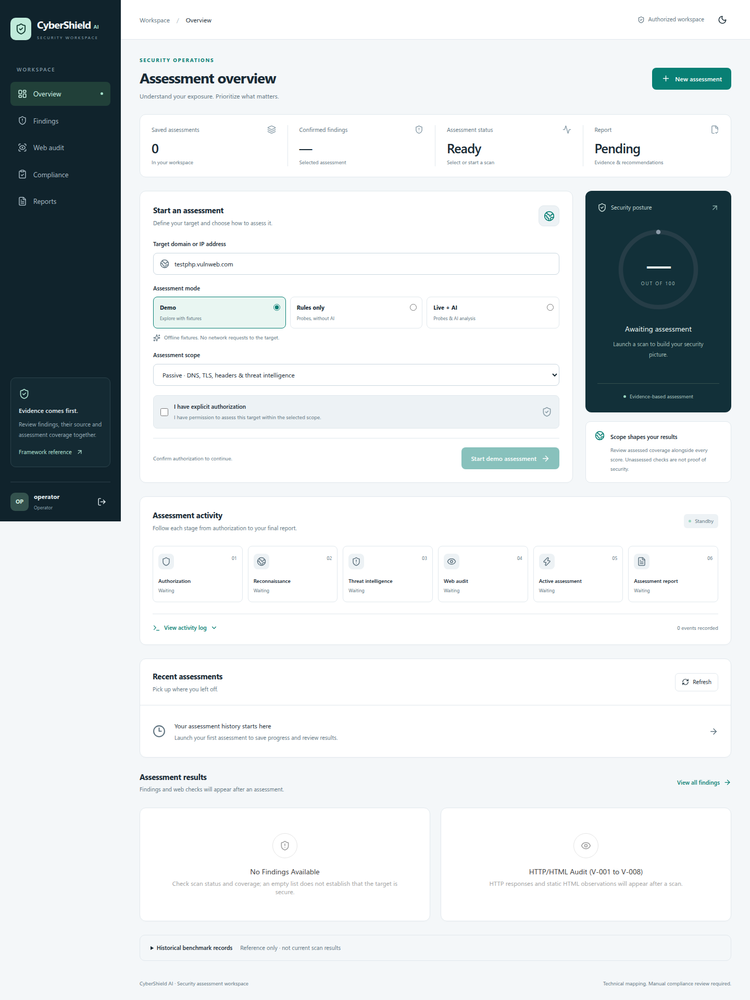

> **AI Hackathon Pakistan 2026 Submission**
>
> **Project ID:** P01869 | **Applicant:** Danyal Mudassar
>
> Originally listed as Kinetix AI Coach. A title/domain change request to CyberShield AI was submitted on 4 September 2026 under the ticket subject "Project Title & Domain Change Request to CyberShield AI - P01869". This reference records the request; approval is not asserted.

# CyberShield AI

[](https://github.com/danyalmudassar/CyberShield_AI/actions/workflows/backend.yml)
[](https://github.com/danyalmudassar/CyberShield_AI/actions/workflows/frontend.yml)

[Quick start](#start-the-local-demo) · [Documentation](docs/README.md) · [Alibaba deployment](docs/alibaba-deployment.md) · [Contributing](CONTRIBUTING.md)

Local web-security assessment dashboard with deterministic probes, optional AI analysis, a project-defined technical control matrix, and PDF reports.

## Workspace preview

Dedicated sign-in, scoped assessments, persistent history and PDF reports.
See the [submission walkthrough](docs/SUBMISSION.md) and [UI verification](docs/ui-redesign.md).



## Start the local demo

On Linux, from this directory use Python 3.12 and Node.js 20.9 or later:

```bash
python -m venv .venv
.venv/bin/python -m pip install --require-hashes --only-binary=:all: -r CyberShield_AI/requirements.txt
npm --prefix frontend ci
.venv/bin/python run_local.py
```

The launcher prompts privately for an operator password (12–256 characters) if no account password is configured. For noninteractive startup, supply `CYBERSHIELD_OPERATOR_PASSWORD` through your environment/secret manager. No default password is enabled.

Open **http://127.0.0.1:3000**, sign in as `operator@cybershield.ai` with the configured password, confirm authorization, choose **Demo**, and launch. The default launcher configures fixture-only execution; no target probes or AI requests run in that mode. Scan records and events are stored in `CyberShield_AI/data/scans.sqlite3`; generated PDFs remain in `CyberShield_AI/reports/`.

Press Ctrl+C to stop both services. For explicitly authorized real target testing, use `run_local.py --allow-live`. Target HTTP/TLS requests now enforce scope, validate redirect hops, and pin new connections to checked IPs; see [transport policy](CyberShield_AI/docs/target-scope-policy.md). Keep this release local. `rules_only` performs target/network intelligence checks but skips AI; it does not mean offline.

Alternate ports:

```bash
.venv/bin/python run_local.py --api-port 8100 --ui-port 3100
```

## Container demo

A separate Docker Compose path builds the backend and Next.js standalone dashboard, with persistent data/report volumes and a loopback dashboard on port 3300. Configure a password secret file first; follow the [container release instructions](docs/container-release.md). This packaging runs fixture-only demos.

## Repository layout

```text
CyberShield_AI/     Backend API, agents, persistence and tests
frontend/          Next.js login, signup and assessment workspace
deploy/cloud/      HTTPS gateway and server configuration helper
docs/              Setup, verification and deployment guides
.github/           CI workflows and contribution templates
```

## Accounts

Use **Create an account** on `/login` to register a new operator account, or sign in
with the account configured by the launcher. Passwords are hashed; sessions and scan
ownership are enforced by the backend. See [authentication](docs/authentication.md).

## Alibaba Cloud

The [ECS deployment guide](docs/alibaba-deployment.md) covers the complete application
behind HTTPS with persistent scan/report volumes. Actual cloud deployment requires
your ECS instance, DNS and access configuration; no public deployment is implied.

## Implemented workflow

- Explicit authorization and live/rules-only/demo selection.
- Scan creation by POST, persistent scan IDs, replayable SSE progress, history, and restart recovery.
- Reconnect and page refresh observe the existing job rather than starting another scan.
- Cancellation of queued work and process-isolated stage termination on timeout/cancellation. Explicit thread test mode does not hard-stop running stages.
- Deterministic and candidate findings retain separate confirmation/provenance states.
- Reports preserve supplied scan data and expose PDF-generation failures.
- Per-scan model settings do not modify shared process environment.

## Scan execution limits

The worker runs two scans concurrently by default and admits at most 100 pending
jobs (queued/running/cancelling). A full queue returns 429; idempotent retries keep
the original scan ID. API callers can set `max_duration_seconds` (default 300,
maximum 900) and `max_stage_seconds` (default 120, maximum 300). Both are positive
integer seconds. Completed jobs survive restart; interrupted executions are not
automatically rerun, while queued jobs resume. See the
[worker lifecycle policy](CyberShield_AI/docs/worker-lifecycle-policy.md) for
exclusive database ownership, shutdown, platform scope and remaining limits.

## Backup and recovery

Offline backup/restore now covers scan data, accounts and PDFs with integrity checks. Restore uses a new directory, revokes historical sessions and prevents old queued work from rerunning. Follow the tested [backup/restore runbook](docs/backup-restore.md), including a separate Compose recovery deployment.

## Operational checks

`/api/ready` checks worker/database readiness; `/api/operations` provides an admin-only queue and request-metric snapshot. Structured request/job events omit credential payloads. See the [operations runbook](CyberShield_AI/docs/operations.md) for interpretation and limits.

## Verification

```bash
cd CyberShield_AI
python -m pytest -q
```

```bash
cd frontend
npx tsc --noEmit
npm run build
```

Unit tests block network sockets and DNS while allowing local UNIX socketpairs used by the in-process API test client. Live/integration tests are excluded by default. Browser smoke testing uses the local demo only.

## Deployment boundary

This is a local single-team release path, not a public multi-tenant service. Use **one API process per SQLite database**. Multiple API workers are not supported. The dashboard requires configured login credentials and uses HttpOnly, revocable sessions; protected APIs also require authentication over loopback. See [authentication/session policy](CyberShield_AI/docs/auth-session-policy.md) for configuration, CSRF, command-line access and remaining limitations. Deployment TLS, infrastructure egress controls, and production recovery remain release gates. Default stage processes support timeout/cancellation termination; the explicit thread test mode does not provide hard termination.

The 12-group control matrix is project-defined technical guidance, not certification or a verified complete PISF crosswalk. Some groups require manual evidence. See [assessment policy](CyberShield_AI/docs/assessment-policy.md).

## Project layout and remaining work

- `CyberShield_AI/`: Python backend, agents, evidence models, storage, tests.
- `frontend/`: Next.js dashboard; separate Git repository from the backend.
- [Completion plan](docs/plans/2026-09-06-project-completion.md): full release roadmap.
- [Current implementation status](docs/plans/2026-09-07-progress.md): implemented slices and outstanding release gates.

Never copy real API keys into documentation or commit environment files. Python dependencies now have complete transitive hash locks for Python 3.12/Linux. See [container release instructions](docs/container-release.md) for the clean-install evidence, runtime-only lock and local Docker deployment.
